# Job Portal Web Application

<p align="center">


</p>

**Job-portal** is a platform that helps users search for jobs and manage applications.

---

## 📑 Table of Contents
* [Screenshots](#-screenshots)
* [Tech Stack](#-tech-stack)
* [How to Run the Project](#-how-to-run-the-project)
* [Project Structure](#-project-structure)
* [Database Structure](#-database-structure)

---

## 📸 Screenshots

### 🏠 Main Pages

<p align="center">
  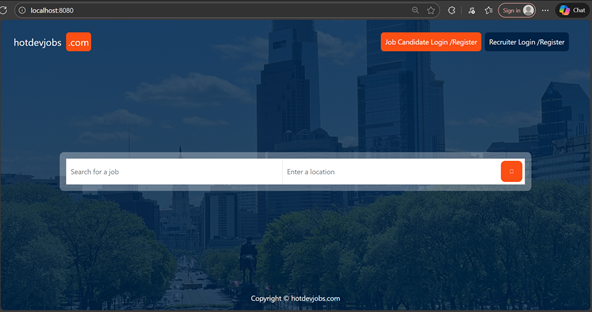
  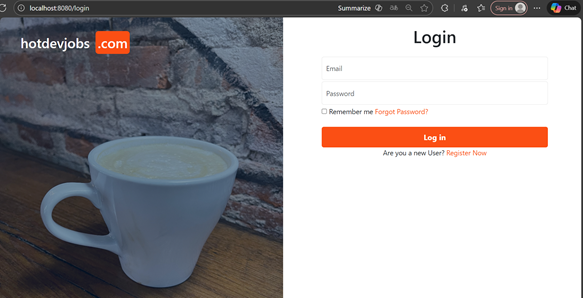
  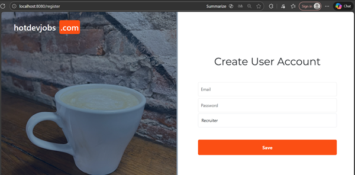
</p>

---

### 👔 Recruiter Profile

<p align="center">
  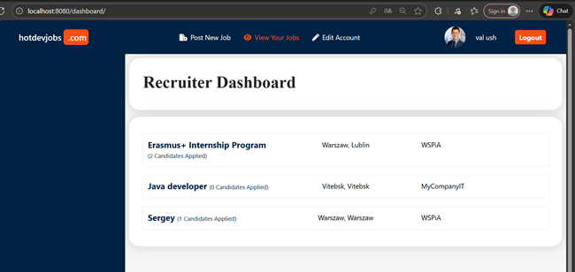
  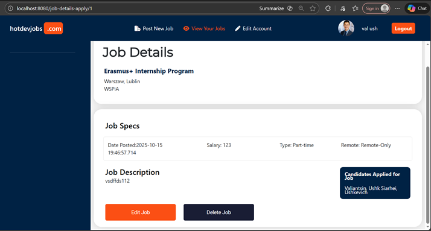
  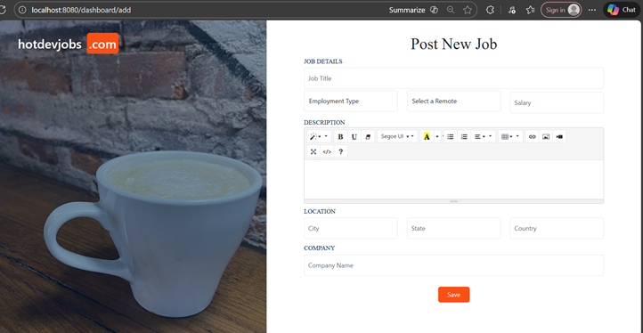
  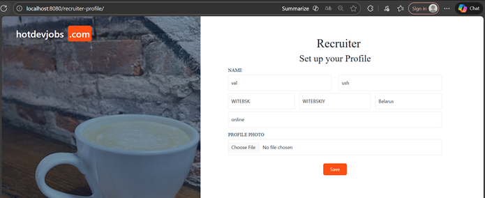
</p>

---

### 👤 Candidate Profile

<p align="center">
  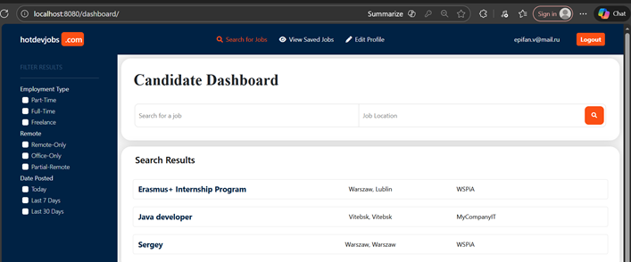
  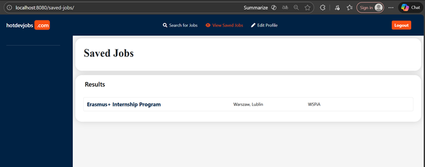
  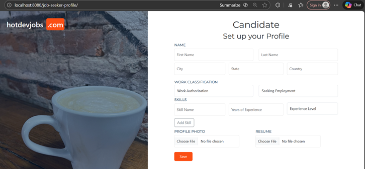
  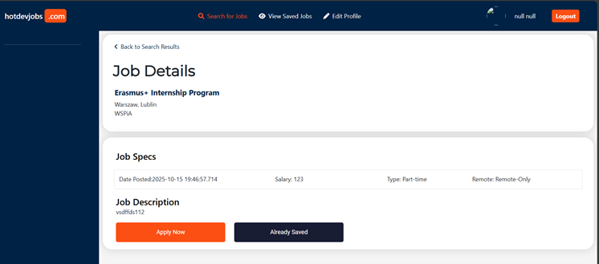
</p>

---

## 🏗 Tech Stack

* **Java:** 21
* **Spring Boot:** 3.4.10
* **Apache-Maven:** 4.0.0
* **Database:** MySQL
* **Frontend:** Thymeleaf, HTML, CSS, JavaScript, Bootstrap 

---

## 🚀 How to Run the Project

1.  **Clone the repository:**
    ```bash
    git clone https://github.com/sierjo/Job-portal.git
    ```
2. **Set up and build a database:**
    ```bash
    Run sql scripts from ./docs/data_base.
    Use localhost:3306 for database.
    ```
3.  **Go to the project folder:**
    ```bash
    cd Job-portal/jobportal
    ```
4.  **Build the project:**
    ```bash
    mvn clean install
    ```
5.  **Run the project:**
    ```bash
    mvn spring-boot:run
    ```
    The application will be available at `http://localhost:8080/`.

---

## 📂 Project Structure

<p align="center">
  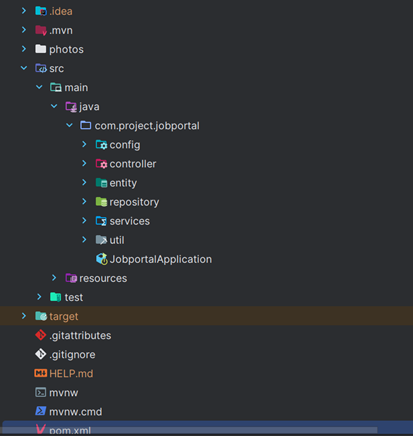
  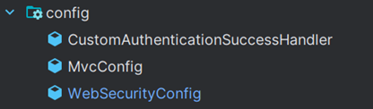
  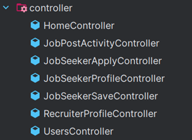
  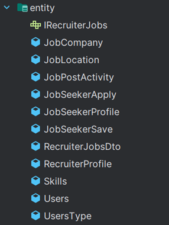
  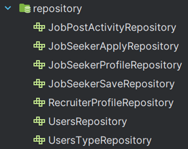
  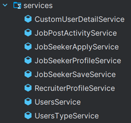
  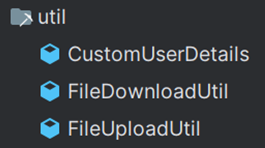
  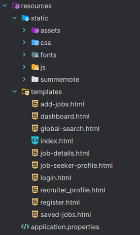
</p>

---

## 📂 Database structure
<p align="center">
  <a href="./docs/database-structure.png">
    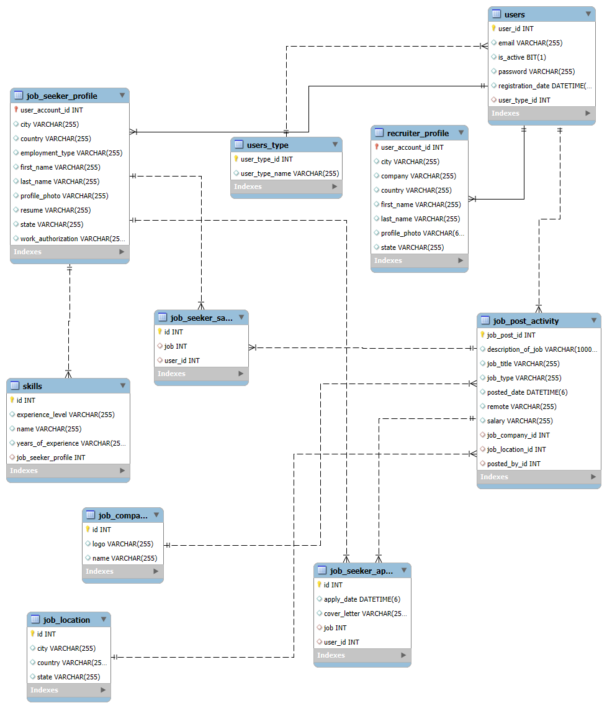
  </a>
</p>
